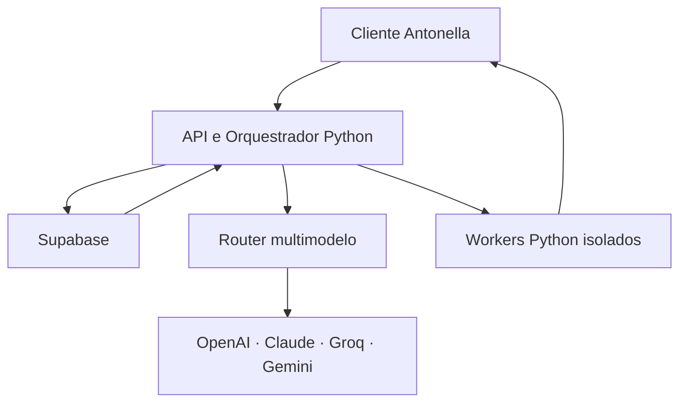
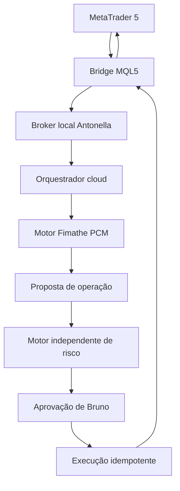

# Antonella — Plano Mestre de Transformação

> Documento de arquitetura, decisões e backlog para transformar o fork `bfrpaulondev/Mark-BP` num assistente pessoal cloud-first, multimodelo, extensível, auditável e seguro.

**Estado:** planeamento aprovado para execução futura  
**Projeto:** Antonella  
**Repositório:** `bfrpaulondev/Mark-BP`  
**Branch base:** `main`  
**Criado em:** 2026-08-25  
**Responsável pelo produto:** Bruno Paulon

---

## 1. Visão do produto

Antonella será um assistente pessoal de voz e texto capaz de compreender objetivos, escolher o modelo de IA apropriado, recuperar memória relevante, planear, executar ferramentas, verificar resultados, aprender procedimentos e adquirir novas habilidades.

O produto não deve ser apenas um chatbot com comandos. Deve funcionar como um sistema operativo de agentes pessoais:

1. ouvir ou receber uma instrução;
2. compreender a intenção e o contexto;
3. recuperar somente as memórias e habilidades relevantes;
4. criar um plano verificável;
5. avaliar riscos e solicitar aprovação quando necessário;
6. executar a ação com ferramentas reais;
7. observar e validar o resultado;
8. corrigir falhas dentro de limites definidos;
9. apresentar evidências do que foi realizado;
10. guardar apenas aprendizagens úteis, com origem, confiança e histórico.

### Objetivos principais

- Ser significativamente mais confiável do que o código atual.
- Suportar OpenAI, Anthropic Claude, Groq e Google Gemini sem dependência rígida de um fornecedor.
- Usar modelos rápidos e baratos por padrão, escalando para modelos avançados somente quando necessário.
- Guardar memória, habilidades, estados e auditoria na cloud.
- Permitir habilidades descritas em Markdown e executadas em Python.
- Aprender por comandos explícitos, feedback e procedimentos aprovados.
- Controlar o Windows, navegador, aplicações e serviços externos com segurança.
- Funcionar como copiloto especializado do MetaTrader 5, começando por análise e desenho do método Fimathe PCM e evoluindo para execução confirmada sob políticas independentes de risco.
- Disponibilizar uma UI/UX completamente nova, moderna, futurista, responsiva e acessível.
- Ser observável: toda decisão, ferramenta, custo, erro e resultado importante deve poder ser inspecionado.

### Não objetivos iniciais

- Treinar um modelo fundacional próprio.
- Permitir que a Antonella altere silenciosamente o próprio núcleo.
- Executar Python arbitrário sem isolamento e aprovação.
- Enviar continuamente todo o áudio ambiente para a cloud.
- Prometer autonomia ilimitada ou memória perfeita.
- Comercializar código herdado antes de resolver a licença do projeto original.

---

## 2. Restrições e riscos existentes

O fork atual deve ser tratado como protótipo e referência, não como arquitetura final.

- `main.py` e `ui.py` são monólitos grandes e misturam interface, sessão de voz, ferramentas e estado.
- A sessão principal está fortemente acoplada ao Gemini Live.
- `core/llm_client.py` possui suporte parcial a Ollama e servidores compatíveis com OpenAI, mas não governa o agente principal.
- A memória atual usa JSON, possui limite muito pequeno e perde contexto importante.
- Plugins são importados e executados dentro do processo principal, sem sandbox real.
- Existem módulos de STT e TTS parcialmente implementados, mas não estão integrados de forma consistente e faltam dependências declaradas.
- Não existe uma suíte adequada de testes, avaliação de agentes, CI, observabilidade ou recuperação de tarefas.
- Um ficheiro de chave privada foi removido por commit, mas continua potencialmente presente no histórico Git.
- A licença atual permite uso pessoal e não comercial. Qualquer produto comercial exigirá autorização do autor ou reimplementação clean-room das partes necessárias.
- O nome, identidade visual e referências a JARVIS/Mark devem ser substituídos por uma identidade original da Antonella.

---

## 3. Princípios obrigatórios de engenharia

1. **Cloud-first, sem dados pessoais persistidos localmente por padrão.**
2. **Cliente mínimo no dispositivo.** Microfone, reprodução de áudio e ações no Windows exigem um agente local, mas o cérebro e a memória ficam na cloud.
3. **Provider-neutral.** Nenhuma regra de negócio deve depender diretamente do SDK de um modelo.
4. **Resultados antes de afirmações.** A Antonella só confirma uma ação depois de verificá-la.
5. **Least privilege.** Cada habilidade recebe apenas as permissões necessárias.
6. **Human in the loop.** Ações destrutivas, financeiras, públicas ou irreversíveis exigem aprovação.
7. **Memória com proveniência.** Toda aprendizagem deve possuir origem, data, confiança, escopo e versão.
8. **Skills sob demanda.** O modelo recebe somente as habilidades relevantes para reduzir custo, latência e confusão.
9. **Tudo versionado.** Prompts, habilidades, esquemas, migrações e políticas devem ter histórico.
10. **Sem segredos no Git, UI, logs ou tabelas públicas.**
11. **Falhas recuperáveis.** Tarefas longas devem pausar, retomar, cancelar e evitar efeitos duplicados.
12. **Qualidade mensurável.** Alterações precisam de testes, métricas e critérios de aceitação.

---

## 4. Arquitetura alvo



### 4.1 Cliente desktop

Responsável apenas por:

- autenticação e emparelhamento do dispositivo;
- captura temporária de microfone;
- wake word e VAD efémeros para reduzir latência, custo e envio de ruído;
- reprodução e interrupção de voz;
- apresentação da UI;
- execução de ações locais explicitamente permitidas;
- transmissão de eventos e progresso por WebSocket;
- armazenamento local restrito ao mínimo técnico, como token de sessão protegido pelo cofre do sistema operativo.

O cliente não será a fonte de verdade da memória, tarefas, configurações ou habilidades.

### 4.2 API e orquestrador Python

- FastAPI assíncrono.
- WebSocket persistente para eventos e streaming.
- Ciclo de agente planear → aprovar → executar → observar → verificar → finalizar.
- Router multimodelo com orçamento, fallback, circuit breaker e telemetria.
- Recuperação híbrida de memória e habilidades.
- Políticas de autorização independentes do modelo.
- Criação, validação e publicação de habilidades.
- API versionada e contratos Pydantic.

### 4.3 Supabase

- Postgres para memória, conversas, tarefas, configurações, permissões e auditoria.
- pgvector para pesquisa semântica.
- Full-text search para pesquisa lexical e híbrida.
- Auth para utilizadores e dispositivos.
- Storage privado para Markdown, Python, anexos e artefactos.
- Realtime para atualizações do dashboard.
- Queues/Cron quando apropriado para tarefas persistentes e agendadas.
- RLS em todas as tabelas expostas, com isolamento por `owner_id` e escopo de projeto.

### 4.4 Workers Python

- Execução de habilidades cloud em containers isolados.
- Limites de CPU, memória, tempo, disco e rede.
- Imagem base versionada e dependências fixadas.
- Artefactos de entrada e saída via Storage privado.
- Resultados estruturados, logs redigidos e códigos de erro estáveis.
- Nenhum worker recebe automaticamente todas as chaves ou memórias.

### 4.5 Router multimodelo

Papéis recomendados, nunca hardcoded a um modelo específico:

| Papel | Uso |
|---|---|
| `fast` | intenção, classificação, respostas simples e seleção de ferramenta |
| `balanced` | planeamento comum, escrita, análise e recuperação de falhas simples |
| `expert` | programação difícil, análise complexa e tarefas de alto valor |
| `critic` | verificação independente de planos e resultados importantes |
| `vision` | interpretação de ecrã, imagem e documentos visuais |
| `transcription` | fala para texto |
| `speech` | texto para fala |
| `embedding` | indexação e pesquisa semântica |

O catálogo deve ser configurável e atualizado sem alterar o núcleo.

### 4.6 Integração de aplicações locais críticas — MT5

O MetaTrader 5 será o primeiro caso de integração local profunda e servirá como referência para futuras aplicações profissionais. A integração não dependerá primariamente de visão computacional ou coordenadas do rato.



Responsabilidades:

- **Bridge MQL5:** ticks, candles, conta, símbolos, posições, ordens, eventos de negociação e objetos do gráfico.
- **Broker local Antonella:** canal autenticado, allowlist de comandos, confirmação de origem e interrupção imediata.
- **Conector Python MetaTrader 5:** leitura e validação de dados estruturados; nunca usar pixels como fonte primária de preço.
- **Motor Fimathe PCM:** regras determinísticas, versionadas e testadas; modelos de linguagem não decidem se uma condição matemática ocorreu.
- **Renderer MQL5:** cria, atualiza e remove CA, C1, canais, PCM, entradas, stops, alvos e invalidações por preço e tempo.
- **Visão computacional:** interpreta contexto visual e elementos sem API; funciona como observador e fallback.
- **Controlo de rato/teclado:** reservado para navegação e ações sem API, sempre com janela, resolução e alvo verificados.
- **Motor de risco:** componente separado do LLM e da estratégia, capaz de bloquear qualquer ordem.
- **Execução:** ordem real somente após proposta estruturada, validação e confirmação explícita de uso único.

Modos obrigatórios, promovidos somente após aprovação e evidências:

```text
observer → drawing → replay → backtest → demo-confirmed → live-confirmed
```

Não existirá modo live autónomo na primeira versão. O sistema deve impedir tecnicamente que texto produzido por um modelo chegue diretamente a `order_send`.

#### Requisitos Fimathe PCM já conhecidos, ainda sujeitos a especificação formal

- mercado inicial: XAUUSD;
- timeframe inicial: M1;
- C1 formada uma única vez no ciclo definido;
- se o preço retornar e romper o canal na direção oposta à C1, a entrada poderá ocorrer no rompimento da CA sem aguardar novo rompimento da C1;
- perfil opcional para considerar apenas as três primeiras entradas da abertura diária;
- bloqueio diário após três perdas consecutivas;
- regras de consistência, drawdown e elegibilidade para saque devem vir de um perfil versionado da prop firm, nunca de valores espalhados no código.

Estes pontos são requisitos de produto, não uma especificação final da estratégia. Antes da implementação serão definidos exemplos positivos, negativos, ambiguidades, timezone, sessão, formação e reset de estruturas, preços bid/ask, spread, slippage, stops, alvos e critérios de invalidação.

---

## 5. Modelo de memória e aprendizagem

### Tipos de memória

- **Working memory:** contexto temporário da execução atual.
- **Episódica:** o que aconteceu em conversas e tarefas.
- **Semântica:** factos, pessoas, preferências e conhecimento.
- **Procedimental:** métodos, rotinas e instruções reutilizáveis.
- **Projetos:** decisões, links, ambientes, estado e próximos passos por projeto.
- **Feedback:** correções, avaliações e preferências sobre resultados anteriores.

### Estados de uma memória

```text
proposed → approved → active → superseded → archived
```

Cada memória deve conter, no mínimo:

- `owner_id`;
- `project_id` opcional;
- tipo e título;
- conteúdo Markdown;
- resumo;
- origem e evidência;
- confiança;
- sensibilidade;
- validade temporal/expiração opcional;
- versão e relação com a memória substituída;
- embedding e versão do modelo de embedding;
- datas de criação, aprovação e atualização.

### Comandos de aprendizagem

| Comando natural | Comportamento esperado |
|---|---|
| “Aprende que…” | cria memória factual proposta |
| “Prefiro…” | cria ou atualiza preferência |
| “Sempre/Nunca…” | propõe regra permanente |
| “Aprende como…” | cria procedimento estruturado |
| “Transforma isto numa habilidade” | inicia skill draft com testes |
| “Corrige…” | cria nova versão e substitui a anterior |
| “Esquece…” | solicita confirmação e arquiva/remove conforme política |
| “Mostra o que sabes…” | recupera memórias com origem e confiança |
| “De onde aprendeste isto?” | apresenta proveniência e histórico |

Conteúdo vindo de páginas, emails, anexos ou ferramentas nunca pode tornar-se regra permanente sem validação. Isso é uma defesa obrigatória contra prompt injection.

---

## 6. Formato das habilidades

Cada habilidade será composta por:

```text
skills/<slug>/
├── SKILL.md
├── manifest.yaml
├── skill.py
├── requirements.lock
├── tests/
└── resources/
```

### Responsabilidade dos ficheiros

- `SKILL.md`: objetivo, quando usar, regras, passos, exemplos, critérios de sucesso e falhas conhecidas.
- `manifest.yaml`: identidade, versão, schemas, riscos, permissões, compatibilidade e recursos.
- `skill.py`: execução tipada e determinística.
- `requirements.lock`: dependências exatas e hashes.
- `tests/`: testes unitários, contratos, casos de erro e segurança.
- `resources/`: templates e recursos não secretos.

### Ciclo de vida

```text
draft → validating → tested → awaiting_approval → active → deprecated → revoked
```

### Regras obrigatórias

- Código gerado nunca é ativado automaticamente.
- Permissões precisam de declaração explícita.
- Alterações de permissão exigem nova aprovação.
- Código executa fora do processo principal.
- Inputs e outputs são validados por schemas.
- Toda execução possui timeout e idempotency key.
- Segredos são fornecidos individualmente pelo backend e nunca persistidos no pacote.
- Skills externas exigem análise de proveniência, licença, dependências e integridade.
- MCP pode expor habilidades, mas aprovação e auditoria continuam sob controlo da Antonella.

---

## 7. Visão UI/UX — Antonella

A interface atual será substituída, não apenas retocada.

### Identidade

- Nome original: **Antonella**.
- Evitar cópia visual, sonora ou textual de JARVIS/Iron Man.
- Estética futurista própria: grafite profundo, superfícies translúcidas controladas, violeta elétrico e ciano como acentos.
- Tipografia extremamente legível, com hierarquia clara.
- Movimento funcional: animação deve comunicar estado, não decorar excessivamente.
- Acessibilidade e contraste acima do efeito visual.

### Estados visuais da presença

| Estado | Comportamento visual |
|---|---|
| `idle` | presença discreta e baixo consumo |
| `listening` | pulso reativo ao áudio |
| `transcribing` | fluxo de ondas para texto |
| `thinking` | atividade orbital com etapa atual visível |
| `awaiting_approval` | destaque âmbar e ação clara |
| `executing` | progresso, ferramenta e possibilidade de cancelar |
| `speaking` | visualização sincronizada com a voz |
| `success` | confirmação curta com evidência |
| `error` | diagnóstico direto e opção de recuperação |
| `offline` | estado explícito, sem simular disponibilidade |

### Superfícies principais

1. **Presence/HUD:** modo compacto, voz, transcrição e progresso.
2. **Command Center:** conversa completa, anexos, tarefas e resultados.
3. **Today:** briefing, agenda, tarefas, alertas e projetos recentes.
4. **Tasks:** planos ativos, etapas, bloqueios, pausa, retoma e cancelamento.
5. **Brain Studio:** memórias, relações, pesquisa semântica, correção e esquecimento.
6. **Skills Studio:** catálogo, editor Markdown/Python, permissões, testes e versões.
7. **Connections:** OpenAI, Claude, Groq, Gemini, GitHub e futuros conectores.
8. **Activity:** histórico auditável de ações, custos, ferramentas e resultados.
9. **Settings:** voz, privacidade, orçamento, modelos, dispositivos e acessibilidade.
10. **Mobile/PWA:** controlo remoto, aprovações e acompanhamento de tarefas.

### Tecnologia preferida

- Separar UI e domínio por MVVM/eventos.
- Avaliar PySide6 + Qt Quick/QML para a aplicação desktop moderna.
- Dashboard cloud em React/Next.js somente se a separação trouxer benefício real.
- Tokens de design únicos compartilhados entre desktop e web.
- Nunca voltar a concentrar toda a interface num único `ui.py`.

---

## 8. Metas não funcionais

| Métrica | Meta inicial |
|---|---|
| Despacho de comando determinístico | p95 < 1 s após transcrição |
| Primeira resposta audível simples | p95 < 3 s após fim da fala |
| Recuperação de memória | p95 < 300 ms |
| Disponibilidade da API | ≥ 99,5% durante beta |
| Sucesso em comandos diretos | ≥ 95% na suíte de avaliação |
| Ação crítica sem aprovação | 0 ocorrências |
| Segredos em logs/UI/Git | 0 ocorrências |
| Cobertura do núcleo crítico | ≥ 85% |
| UI principal | 60 FPS no hardware alvo |
| Tarefa persistente após reinício | 100% dos cenários testados |

---

# 9. Backlog executável

## Fase 0 — Governança, licença e linha de base

- [x] **ANT-000 — Adotar oficialmente o nome Antonella.** Registar a decisão, remover novos usos de Mark/JARVIS e definir o nome técnico dos pacotes. Evidência: [ADR-0001](adr/0001-antonella-project-identity.md).
- [x] **ANT-001 — Inventariar todo o código e dependências herdadas.** Produzir mapa de módulos, responsabilidades, tamanhos, licenças e pontos de acoplamento. Evidência: [inventário técnico](current-state/legacy-inventory.md).
- [ ] **ANT-002 — Auditar a licença original.** Determinar o que pode permanecer para uso pessoal e o que exigiria autorização ou reimplementação para uso comercial.
- [ ] **ANT-003 — Criar estratégia clean-room.** Definir como substituir componentes herdados caso o projeto se torne comercial.
- [ ] **ANT-004 — Tratar a chave privada existente no histórico.** Considerá-la comprometida, revogar certificados relacionados e decidir se o histórico deve ser reescrito com procedimento seguro.
- [x] **ANT-005 — Criar política de branches e PRs.** Proibir commits diretos na `main`, force push e merges sem testes. Evidência: [CONTRIBUTING.md](../CONTRIBUTING.md).
- [ ] **ANT-006 — Definir convenções de commits, versões e changelog.** Adotar versionamento semântico e Conventional Commits.
- [ ] **ANT-007 — Ativar GitHub Issues e preparar labels/milestones.** Transformar este roadmap em issues rastreáveis sem duplicação.
- [ ] **ANT-008 — Criar ADRs iniciais.** Registar decisões sobre Supabase, FastAPI, workers, modelo de skills, cliente mínimo e UI.
- [ ] **ANT-009 — Capturar baseline funcional.** Documentar o que funciona hoje e gravar evidências dos fluxos principais antes da refatoração.

**Gate da fase:** riscos legais e de segurança documentados; baseline reproduzível; processo de contribuição aprovado.

## Fase 1 — Estabilização do fork

- [x] **ANT-010 — Fixar Python suportado.** Selecionar versão oficial e criar ficheiros de configuração consistentes. Evidência: [suporte de Python](current-state/python-support.md) e [`.python-version`](../.python-version).
- [x] **ANT-011 — Substituir `requirements.txt` aberto por dependências fixadas.** Gerar lockfile com hashes e dependências específicas por sistema operativo. Evidência: [`pyproject.toml`](../pyproject.toml), [`uv.lock`](../uv.lock), [`requirements.txt`](../requirements.txt) e [gestão de dependências](current-state/dependencies.md).
- [x] **ANT-012 — Corrigir dependências de STT/TTS ausentes.** Garantir que toda importação opcional possui extra documentado e erro acionável. Evidência: [perfis opcionais](current-state/dependencies.md), [`core/stt.py`](../core/stt.py), [`core/tts.py`](../core/tts.py) e [testes](../tests/test_optional_voice_dependencies.py).
- [ ] **ANT-013 — Criar configuração tipada.** Substituir leituras dispersas de JSON por Pydantic Settings e variáveis de ambiente.
- [ ] **ANT-014 — Remover instalação automática de pacotes em runtime.** Instalações devem ocorrer apenas por processo explícito e auditado.
- [ ] **ANT-015 — Criar logging estruturado.** IDs de correlação, níveis consistentes e redação de segredos/PII.
- [ ] **ANT-016 — Criar tratamento global de erros.** Separar erros recuperáveis, configuração, fornecedor, permissão e falhas internas.
- [ ] **ANT-017 — Adicionar lint, formatter e type checking.** Configurar Ruff, formatter e verificação estática adequada.
- [x] **ANT-018 — Criar suíte mínima de testes.** Cobrir configuração, memória atual, plugin loader e dispatch de ferramentas. Evidência: [`tests/`](../tests/).
- [ ] **ANT-019 — Criar CI inicial.** Lint, tipos, testes, auditoria de dependências e verificação de segredos.
- [x] **ANT-020 — Documentar instalação reproduzível.** Windows como plataforma primária; macOS/Linux apenas quando testados. Evidência: [dependências e instalação reproduzível](current-state/dependencies.md).

**Gate da fase:** instalação limpa reproduzível; CI verde; nenhuma dependência instalada silenciosamente em execução.

## Fase 2 — Separação do núcleo

- [ ] **ANT-021 — Definir contratos do domínio.** `AgentRun`, `Message`, `Tool`, `Skill`, `Memory`, `Approval`, `ProviderResponse` e `ExecutionResult`.
- [ ] **ANT-022 — Extrair configuração de `main.py`.** Nenhum fornecedor ou caminho deve ser decidido no ponto de entrada.
- [ ] **ANT-023 — Extrair sessão e transporte de voz.** Áudio não deve conhecer lógica de memória ou ferramentas.
- [ ] **ANT-024 — Extrair tool registry.** Ferramentas nativas e skills devem implementar contrato comum.
- [ ] **ANT-025 — Extrair executor de ferramentas.** Timeout, cancelamento, idempotência e erros tipados.
- [ ] **ANT-026 — Extrair orquestrador de agente.** Criar ciclo de execução independente de UI e fornecedor.
- [ ] **ANT-027 — Criar event bus interno tipado.** UI, voz, tarefas e auditoria comunicam-se por eventos.
- [ ] **ANT-028 — Criar camadas `domain`, `application`, `infrastructure` e `interfaces`.** Impedir dependências invertidas.
- [ ] **ANT-029 — Dividir `ui.py`.** Primeiro corte por responsabilidades, sem redesenho visual ainda.
- [ ] **ANT-030 — Tornar o núcleo executável sem UI.** Testes headless devem executar conversas e ferramentas simuladas.
- [ ] **ANT-031 — Criar adapters para o comportamento legado.** Preservar temporariamente funcionalidades úteis durante a migração.
- [ ] **ANT-032 — Remover singletons e estado global mutável.** Usar injeção explícita de dependências.

**Gate da fase:** o agente funciona em testes headless; UI e Gemini deixam de ser dependências do domínio.

## Fase 3 — Backend cloud e Supabase

- [ ] **ANT-033 — Criar projeto Supabase dedicado por ambiente.** Separar desenvolvimento, staging e produção.
- [ ] **ANT-034 — Criar FastAPI cloud.** Health checks, versionamento, OpenAPI, autenticação e IDs de correlação.
- [ ] **ANT-035 — Modelar `profiles`, `devices` e `agents`.** Relacionar com `auth.users` sem copiar dados desnecessários.
- [ ] **ANT-036 — Modelar projetos e contextos.** Isolar memórias, tarefas e habilidades por projeto.
- [ ] **ANT-037 — Modelar conversas e mensagens.** Suportar conteúdo multimodal, ferramentas e referências.
- [ ] **ANT-038 — Modelar memórias e versões.** Incluir estados, proveniência, confiança, sensibilidade, validade e substituição.
- [ ] **ANT-039 — Modelar skills, versões e permissões.** Metadados relacionais; conteúdo e artefactos privados no Storage.
- [ ] **ANT-040 — Modelar tarefas, runs e steps.** Persistência, pausa, retoma, cancelamento, progresso e idempotência.
- [ ] **ANT-041 — Modelar feedback e avaliações.** Relacionar correções com resposta, run, memória ou skill.
- [ ] **ANT-042 — Modelar auditoria imutável.** Registar ator, dispositivo, decisão, ferramenta, efeito e evidência sem PII excessiva.
- [ ] **ANT-043 — Ativar pgvector e pesquisa textual.** Guardar versão/dimensão do embedding e suportar pesquisa híbrida.
- [ ] **ANT-044 — Criar buckets privados.** `skill-code`, `knowledge-files`, `attachments`, `execution-artifacts` e `test-results`.
- [ ] **ANT-045 — Criar políticas RLS e Storage.** `owner_id`, escopo de projeto, dispositivo e administração explícita.
- [ ] **ANT-046 — Indexar foreign keys e filtros RLS.** Validar índices com planos de consulta.
- [ ] **ANT-047 — Criar migrações versionadas.** Nunca alterar produção manualmente sem migração rastreável.
- [ ] **ANT-048 — Criar testes de isolamento.** Provar que utilizador/dispositivo não lê nem altera dados de outro escopo.
- [ ] **ANT-049 — Configurar pool de conexões.** Escolher modo apropriado para API persistente e workers.
- [ ] **ANT-050 — Configurar backup, retenção e recuperação.** Testar restauração, não apenas ativar backup.

**Gate da fase:** esquema, RLS e Storage testados; nenhum `service_role` no cliente; restauração comprovada.

## Fase 4 — Gateway e router multimodelo

- [ ] **ANT-051 — Definir interface `ModelProvider`.** Mensagens, tools, streaming, erros, uso, custo e capacidades normalizadas.
- [ ] **ANT-052 — Implementar provider OpenAI.** Responses API, function calling, streaming e aprovações quando aplicável.
- [ ] **ANT-053 — Implementar provider Anthropic.** Messages API e tool use normalizados.
- [ ] **ANT-054 — Implementar provider Groq.** Modelos rápidos, API compatível e limites do plano.
- [ ] **ANT-055 — Implementar provider Gemini.** Preservar temporariamente capacidades úteis sem acoplar o domínio.
- [ ] **ANT-056 — Criar catálogo dinâmico de modelos.** Capacidades, contexto, modalidades, preço, saúde e disponibilidade.
- [ ] **ANT-057 — Criar papéis `fast`, `balanced`, `expert`, `critic`, `vision`.** Configuração por ambiente e utilizador.
- [ ] **ANT-058 — Implementar router por tarefa.** Complexidade, risco, modalidade, latência, custo e preferências.
- [ ] **ANT-059 — Implementar fallback seguro.** Não repetir efeitos de ferramentas ao mudar de fornecedor.
- [ ] **ANT-060 — Implementar circuit breaker e health scoring.** Evitar provedores degradados e recuperar automaticamente.
- [ ] **ANT-061 — Criar limites de custo.** Por pedido, tarefa, dia, fornecedor e modelo.
- [ ] **ANT-062 — Medir custos reais.** Guardar tokens, cache, ferramentas, áudio e estimativa monetária por run.
- [ ] **ANT-063 — Implementar prompt caching quando suportado.** Medir ganho antes de manter a estratégia.
- [ ] **ANT-064 — Criar roteamento determinístico.** Comandos conhecidos não devem chamar um modelo avançado.
- [ ] **ANT-065 — Criar suíte comparativa de modelos.** Sucesso, latência, custo, uso correto de ferramentas e qualidade final.

**Gate da fase:** qualquer provider pode ser desligado; fallback testado; custo de cada run visível.

## Fase 5 — Voz otimizada

- [ ] **ANT-066 — Definir pipeline de áudio.** Captura → wake word/VAD → chunk → transcrição → agente → TTS → reprodução.
- [ ] **ANT-067 — Implementar wake word efémera no cliente.** Nenhuma gravação persistente e opção push-to-talk.
- [ ] **ANT-068 — Implementar VAD e endpointing.** Não enviar silêncio ou áudio ambiente desnecessário.
- [ ] **ANT-069 — Criar adapter de transcrição Groq.** Usar limites e fallback configuráveis.
- [ ] **ANT-070 — Criar adapter OpenAI Transcription.** Upload e streaming quando necessário.
- [ ] **ANT-071 — Manter transcrição local como recurso opcional.** Desativada por padrão no modo cloud-only.
- [ ] **ANT-072 — Criar provider TTS.** Separar voz nativa, serviços cloud e alternativas futuras.
- [ ] **ANT-073 — Implementar streaming de áudio de saída.** Começar a falar antes da resposta completa quando seguro.
- [ ] **ANT-074 — Implementar barge-in.** Interromper imediatamente quando o utilizador voltar a falar.
- [ ] **ANT-075 — Implementar cancelamento e limpeza de buffers.** Nunca reproduzir respostas antigas depois de uma interrupção.
- [ ] **ANT-076 — Criar seleção pt-PT/pt-BR e outros idiomas.** Idioma por sessão e preferência persistida.
- [ ] **ANT-077 — Criar testes com ruído, sotaques e microfones diferentes.** Medir WER, latência e falsos acionamentos.
- [ ] **ANT-078 — Implementar modo Realtime opcional.** Nunca ser o modo obrigatório ou padrão de custo.

**Gate da fase:** comando simples inicia resposta audível em p95 < 3 s; interrupção funciona; nenhum áudio é guardado sem consentimento.

## Fase 6 — Memória cloud e Brain Studio

- [ ] **ANT-079 — Criar `MemoryService`.** API única para propor, aprovar, recuperar, corrigir, arquivar e esquecer.
- [ ] **ANT-080 — Criar chunking semântico.** Preservar títulos, origem, projeto e relações.
- [ ] **ANT-081 — Criar pipeline de embeddings.** Versão do modelo registrada e reindexação controlada.
- [ ] **ANT-082 — Criar pesquisa híbrida.** Full-text + vector + recência + projeto + confiança.
- [ ] **ANT-083 — Criar reranking e orçamento de contexto.** Enviar somente memórias úteis ao modelo.
- [ ] **ANT-084 — Implementar memória episódica.** Runs e conversas resumidos sem perder evidências importantes.
- [ ] **ANT-085 — Implementar memória semântica.** Factos e preferências com conflitos e validade.
- [ ] **ANT-086 — Implementar memória procedimental.** Procedimentos podem originar skills, mas não executam código sozinhos.
- [ ] **ANT-087 — Implementar memória por projeto.** Evitar mistura entre Eutaktos, FieldPilot, Antonella e outros projetos.
- [ ] **ANT-088 — Implementar deteção de contradições.** Nunca sobrescrever silenciosamente uma informação incompatível.
- [ ] **ANT-089 — Implementar proveniência.** Responder “de onde sabes?” com fonte e histórico.
- [ ] **ANT-090 — Implementar esquecimento.** Soft delete, período de recuperação e eliminação definitiva auditada.
- [ ] **ANT-091 — Implementar TTL e revisão.** Informações temporárias expiram ou pedem reconfirmação.
- [ ] **ANT-092 — Criar comandos naturais de aprendizagem.** Cobrir aprender, corrigir, esquecer, mostrar e explicar origem.
- [ ] **ANT-093 — Criar política anti-prompt-injection para memória.** Conteúdo externo nunca vira instrução privilegiada.
- [ ] **ANT-094 — Criar UI Brain Studio.** Pesquisa, filtros, grafo, versões, aprovação, correção e arquivo.
- [ ] **ANT-095 — Criar importação/exportação Markdown.** Dados continuam portáveis e legíveis fora do produto.

**Gate da fase:** memória relevante melhora a resposta em avaliações; conflitos e exclusões possuem comportamento previsível.

## Fase 7 — Skills em Markdown e Python

- [ ] **ANT-096 — Formalizar schema de `manifest.yaml`.** Nome, versão, entrada, saída, risco, permissões, runtime e compatibilidade.
- [ ] **ANT-097 — Formalizar contrato de `SKILL.md`.** Objetivo, gatilhos, regras, passos, exemplos, sucesso e recuperação.
- [ ] **ANT-098 — Formalizar `SkillContext` e `SkillResult`.** Nunca passar diretamente UI, cliente de base ou todas as credenciais.
- [ ] **ANT-099 — Criar registry cloud de skills.** Descoberta, versões, estado, autoria, integridade e dependências.
- [ ] **ANT-100 — Criar upload privado de pacotes.** Assinar e validar hash antes de executar.
- [ ] **ANT-101 — Criar validador estático.** Manifesto, schemas, imports, permissões, licença e padrões perigosos.
- [ ] **ANT-102 — Criar runner isolado.** Processos/containers separados com quotas e timeout.
- [ ] **ANT-103 — Criar gestão de dependências por skill.** Lockfile, allowlist e cache de ambientes imutáveis.
- [ ] **ANT-104 — Criar testes obrigatórios por skill.** Happy path, erros, permissões, timeout e idempotência.
- [ ] **ANT-105 — Criar fluxo de aprovação.** Exibir diff, permissões, testes e risco antes de ativar.
- [ ] **ANT-106 — Criar lifecycle completo.** Draft, teste, aprovação, ativação, atualização, rollback, revogação e remoção.
- [ ] **ANT-107 — Criar seleção dinâmica de skills.** Carregar apenas definições relacionadas ao pedido.
- [ ] **ANT-108 — Criar Skill Builder.** Gerar Markdown, Python e testes a partir de um pedido natural.
- [ ] **ANT-109 — Impedir autoativação de código gerado.** Regra técnica, não apenas instrução de prompt.
- [ ] **ANT-110 — Criar skill de diagnóstico.** Explicar por que uma skill não foi selecionada ou falhou.
- [ ] **ANT-111 — Criar bridge MCP.** Importar/exportar ferramentas com allowlist, aprovação e logging.
- [ ] **ANT-112 — Criar política de supply chain.** Proveniência, assinatura, CVEs, licença e atualização segura.
- [ ] **ANT-113 — Migrar ferramentas atuais gradualmente.** Uma ferramenta por PR, mantendo testes de regressão.

**Gate da fase:** uma skill criada por comando pode ser testada, aprovada, executada, atualizada e revertida sem reiniciar o núcleo.

## Fase 8 — Cérebro executivo e autonomia

- [ ] **ANT-114 — Criar classificador de intenção.** Conversa, comando, aprendizagem, tarefa longa, pergunta ou ação crítica.
- [ ] **ANT-115 — Criar planeador estruturado.** Objetivo, passos, ferramentas, riscos, critérios e limites.
- [ ] **ANT-116 — Criar motor de políticas.** Decidir o que é permitido independentemente da opinião do modelo.
- [ ] **ANT-117 — Criar fluxo de aprovação resumível.** A tarefa pausa sem perder estado e retoma após decisão.
- [ ] **ANT-118 — Criar executor passo a passo.** Cada etapa observa resultado real antes da próxima.
- [ ] **ANT-119 — Criar verificador de conclusão.** Evidência obrigatória e, quando necessário, modelo crítico separado.
- [ ] **ANT-120 — Criar recuperação de falhas.** Retentativas limitadas, estratégia alternativa e escalonamento claro.
- [ ] **ANT-121 — Criar idempotência de ações.** Repetir uma run nunca deve enviar, comprar ou apagar duas vezes.
- [ ] **ANT-122 — Criar pausa, retoma e cancelamento.** Funcionar após reinício de API, worker ou cliente.
- [ ] **ANT-123 — Criar tarefas longas persistentes.** Progresso, checkpoints, heartbeat e timeout.
- [ ] **ANT-124 — Criar tarefas agendadas.** Cron/queue com timezone, repetição e histórico.
- [ ] **ANT-125 — Criar proatividade limitada.** Somente regras aprovadas, horários e canais permitidos.
- [ ] **ANT-126 — Criar modo simulação.** Mostrar plano e efeitos sem executá-los.
- [ ] **ANT-127 — Criar delegação especializada.** Subagentes somente para subtarefas independentes e auditáveis.
- [ ] **ANT-128 — Criar síntese final com evidências.** Resultado, alterações, falhas, custo e próximos passos.

**Gate da fase:** tarefas sobrevivem a reinícios; não há efeitos duplicados; ações críticas sempre param para aprovação.

## Fase 9 — Reconstrução completa da UI/UX

- [ ] **ANT-129 — Fazer auditoria UX da interface atual.** Fluxos, inconsistências, acessibilidade, desempenho e dívida visual.
- [ ] **ANT-130 — Definir personas e jornadas.** Conversa, comando rápido, aprendizagem, tarefa longa, aprovação e recuperação.
- [ ] **ANT-131 — Criar arquitetura de informação.** Presence, Today, Command Center, Tasks, Brain, Skills, Activity, Connections e Settings.
- [ ] **ANT-132 — Criar identidade visual original.** Logo, símbolo, voz, cores e linguagem sem copiar JARVIS/Iron Man.
- [ ] **ANT-133 — Criar design tokens.** Cores, tipografia, espaçamento, radius, sombras, blur, movimento e estados.
- [ ] **ANT-134 — Criar biblioteca de componentes.** Botões, cards, campos, menus, modais, tabelas, timeline, toasts e loaders.
- [ ] **ANT-135 — Prototipar Presence/HUD compacto.** Idle, listening, transcribing, thinking, approval, executing, speaking e error.
- [ ] **ANT-136 — Prototipar Command Center.** Conversa, anexos, tool calls, evidências, streaming e cancelamento.
- [ ] **ANT-137 — Prototipar Today.** Briefing, calendário, tarefas, custos, alertas e projetos.
- [ ] **ANT-138 — Prototipar Tasks.** Planos, steps, logs, progresso, pausa, retoma e dependências.
- [ ] **ANT-139 — Prototipar Brain Studio.** Pesquisa, grafo, origem, confiança, conflitos, versões e esquecimento.
- [ ] **ANT-140 — Prototipar Skills Studio.** Editor dividido Markdown/Python, manifesto, testes, permissões, diff e publicação.
- [ ] **ANT-141 — Prototipar Connections.** Estado, modelos, quotas, chaves, testes de conexão e fallback.
- [ ] **ANT-142 — Prototipar Activity/Audit.** Filtros por tarefa, ferramenta, risco, custo, dispositivo e resultado.
- [ ] **ANT-143 — Prototipar onboarding.** Conta, dispositivo, voz, provedores, orçamento, privacidade e primeira skill.
- [ ] **ANT-144 — Escolher e validar tecnologia desktop.** Spike PySide6/QML com áudio, animação, WebSocket e acessibilidade.
- [ ] **ANT-145 — Implementar shell e navegação.** Rotas, layout, estado global mínimo e recuperação de sessão.
- [ ] **ANT-146 — Implementar state machine visual.** UI derivada de eventos reais, sem estados simulados.
- [ ] **ANT-147 — Implementar streaming e progresso.** Texto, voz, tools e tasks atualizados incrementalmente.
- [ ] **ANT-148 — Implementar aprovações claras.** Consequência, dados enviados, permissões e opções permitir/recusar.
- [ ] **ANT-149 — Implementar acessibilidade.** WCAG, teclado, leitor de ecrã, contraste, foco e reduced motion.
- [ ] **ANT-150 — Implementar responsividade.** Janela pequena, ultrawide, escala do Windows e múltiplos monitores.
- [ ] **ANT-151 — Implementar performance gráfica.** Orçamento de animação, virtualização e perfil de 60 FPS.
- [ ] **ANT-152 — Implementar temas.** Dark principal, light acessível e alto contraste.
- [ ] **ANT-153 — Criar dashboard mobile/PWA.** Aprovar, acompanhar e cancelar tarefas remotamente.
- [ ] **ANT-154 — Realizar testes de usabilidade.** Corrigir problemas observados antes de polir animações.
- [ ] **ANT-155 — Remover definitivamente a UI legada.** Somente após paridade funcional comprovada.

**Gate da fase:** fluxos principais aprovados em testes de usabilidade; UI mantém 60 FPS e funciona integralmente por teclado.

## Fase 10 — Segurança, privacidade e dispositivos

- [ ] **ANT-156 — Criar threat model.** Atacantes, dados, superfícies, abuso de ferramentas e prompt injection.
- [ ] **ANT-157 — Implementar autenticação Supabase.** Sessões, refresh, revogação e expiração adequadas ao risco.
- [ ] **ANT-158 — Implementar emparelhamento de dispositivos.** Chaves por dispositivo, revogação e última atividade.
- [ ] **ANT-159 — Implementar cofre de segredos no backend.** Nunca guardar provider keys em tabelas expostas ou no Git.
- [ ] **ANT-160 — Implementar permissões por capacidade.** Filesystem, shell, browser, mensagens, pagamentos, câmara e microfone.
- [ ] **ANT-161 — Criar níveis de risco.** Verde, amarelo, vermelho e bloqueado com políticas explícitas.
- [ ] **ANT-162 — Implementar sandbox cloud.** Egress allowlist, filesystem efémero e quotas.
- [ ] **ANT-163 — Implementar sandbox local.** Broker de ações com caminhos e comandos permitidos.
- [ ] **ANT-164 — Implementar defesa contra prompt injection.** Separar dados, instruções, memória e resultados de ferramentas.
- [ ] **ANT-165 — Implementar redação de dados sensíveis.** Logs, tracing, erros e UI.
- [ ] **ANT-166 — Implementar URLs assinadas e buckets privados.** Testar leitura, escrita, update e revogação.
- [ ] **ANT-167 — Implementar retenção e exportação de dados.** Controlos visíveis ao utilizador.
- [ ] **ANT-168 — Implementar botão de emergência.** Interromper voz, tasks, workers e ações locais.
- [ ] **ANT-169 — Criar auditoria de segurança automatizada.** Dependências, secrets, RLS, Storage e containers.
- [ ] **ANT-170 — Realizar revisão manual antes do beta.** Nenhuma vulnerabilidade crítica ou alta aberta.

**Gate da fase:** testes negativos de autorização aprovados; nenhuma ação vermelha sem aprovação; incident response documentado.

## Fase 11 — Observabilidade, avaliações e qualidade

- [ ] **ANT-171 — Criar tracing distribuído.** Um `run_id` acompanha cliente, API, modelo, skill, worker e banco.
- [ ] **ANT-172 — Criar métricas operacionais.** Latência, erros, filas, timeouts, tokens, custos e disponibilidade.
- [ ] **ANT-173 — Criar dashboard de saúde.** Provider, API, banco, worker, WebSocket e dispositivo.
- [ ] **ANT-174 — Criar dataset de avaliações.** Português, comandos diretos, projetos, memória, skills e ações críticas.
- [ ] **ANT-175 — Criar evals de tool selection.** Ferramenta correta, argumentos e ausência de tool hallucination.
- [ ] **ANT-176 — Criar evals de memória.** Precisão, relevância, conflitos, isolamento e proveniência.
- [ ] **ANT-177 — Criar evals de planeamento.** Completude, risco, critérios e execução.
- [ ] **ANT-178 — Criar evals de segurança.** Prompt injection, exfiltração, bypass de aprovação e abuso de plugins.
- [ ] **ANT-179 — Criar testes contractuais de providers.** Mesmo comportamento normalizado em OpenAI, Claude, Groq e Gemini.
- [ ] **ANT-180 — Criar testes E2E desktop-cloud.** Voz/texto → plano → ferramenta → verificação → memória.
- [ ] **ANT-181 — Criar testes de resiliência.** Provider indisponível, rede interrompida, worker morto e DB lento.
- [ ] **ANT-182 — Criar testes de carga.** Conexões WebSocket, recuperação vetorial, fila e workers.
- [ ] **ANT-183 — Criar quality gates no CI.** Cobertura, evals mínimas, segurança e orçamento de regressão.
- [ ] **ANT-184 — Criar regressão de custo e latência.** Bloquear mudanças que degradam sem benefício medido.

**Gate da fase:** métricas e evals executam no CI/staging; regressões relevantes bloqueiam release.

## Fase 12 — Deploy, operação e distribuição

- [ ] **ANT-185 — Containerizar API e worker.** Imagens separadas, mínimas, não-root e reproduzíveis.
- [ ] **ANT-186 — Criar ambientes dev/staging/prod.** Secrets, URLs, Supabase e providers completamente separados.
- [ ] **ANT-187 — Criar pipeline de deploy.** Build, testes, migração, rollout, health check e rollback.
- [ ] **ANT-188 — Criar gestão de migrações.** Advisors, revisão, aplicação controlada e verificação pós-deploy.
- [ ] **ANT-189 — Configurar filas e tarefas agendadas.** Dead-letter, retries limitados e observabilidade.
- [ ] **ANT-190 — Criar limites de recursos.** Concorrência, rate limits, quotas e proteção contra runaway agents.
- [ ] **ANT-191 — Criar alertas.** Segurança, custo, indisponibilidade, backlog, erro e latência.
- [ ] **ANT-192 — Criar runbooks.** Provider fora, banco indisponível, credencial comprometida e deploy falhado.
- [ ] **ANT-193 — Empacotar cliente Windows.** Instalador assinado, permissões claras e remoção limpa.
- [ ] **ANT-194 — Criar atualização segura do cliente.** Assinatura, canal beta/stable e rollback.
- [ ] **ANT-195 — Criar telemetria opt-in.** Sem áudio ou conteúdo sensível; controlo e transparência.
- [ ] **ANT-196 — Criar política de privacidade e termos.** Compatíveis com o comportamento real do produto.
- [ ] **ANT-197 — Criar controlo de custos.** Alertas, hard limits e painel diário/mensal.
- [ ] **ANT-198 — Testar disaster recovery.** Restaurar banco, Storage, configuração e filas num ambiente limpo.

**Gate da fase:** staging reproduz produção; rollback e recuperação testados; cliente instalável e removível.

## Fase 13 — Migração, beta e lançamento

- [ ] **ANT-199 — Criar migrador de configuração legada.** Importar preferências úteis sem transportar segredos.
- [ ] **ANT-200 — Criar migrador de memória JSON.** Classificar, deduplicar e pedir aprovação antes de ativar.
- [ ] **ANT-201 — Migrar ferramentas úteis.** Priorizar abrir aplicações, browser, ficheiros, lembretes e GitHub.
- [ ] **ANT-202 — Descontinuar componentes inseguros.** Plugin loader in-process, memória JSON e configuração de chaves em ficheiro.
- [ ] **ANT-203 — Executar alpha interna.** Corrigir P0/P1 antes de convidar utilizadores.
- [ ] **ANT-204 — Executar beta controlada.** Métricas, feedback, custos e incidentes acompanhados.
- [ ] **ANT-205 — Validar metas de desempenho.** Comparar com baseline e publicar resultados reais.
- [ ] **ANT-206 — Validar orçamento por perfil de uso.** Leve, normal, intensivo e voz prolongada.
- [ ] **ANT-207 — Concluir documentação.** Utilizador, desenvolvedor, skills, API, segurança, operação e troubleshooting.
- [ ] **ANT-208 — Resolver licença antes de monetização.** Bloqueio explícito de release comercial enquanto pendente.
- [ ] **ANT-209 — Lançar Antonella v1.0.** Somente após todos os gates obrigatórios.
- [ ] **ANT-210 — Criar roadmap pós-v1.** Casa inteligente, mobile completo, colaboração e marketplace, conforme evidência de uso.

## Fase 14 — Copiloto MT5 e Fimathe PCM

Esta fase é transversal. Contratos e segurança devem ser preparados desde as Fases 2, 7, 8 e 10; desenho e execução real só avançam depois dos respetivos gates.

- [ ] **ANT-211 — Criar ADR da integração MT5.** Definir limites entre MQL5, broker local, Python, cloud, estratégia, risco, UI e responsabilidades do utilizador.
- [ ] **ANT-212 — Criar threat model financeiro específico.** Cobrir ordem duplicada, dados atrasados, janela errada, conta errada, prompt injection, perda de rede, spread extremo e credencial comprometida.
- [ ] **ANT-213 — Formalizar a skill `mt5-fimathe-copilot`.** Criar contrato de Markdown, manifesto, schemas, permissões, riscos, modos e critérios de sucesso.
- [ ] **ANT-214 — Criar broker local de capacidades críticas.** Expor somente ações MT5 permitidas por canal autenticado, com allowlist, nonce, expiração e auditoria.
- [ ] **ANT-215 — Descobrir e emparelhar instalações MT5.** Identificar terminal, conta, servidor, modo demo/real e permitir revogação por dispositivo.
- [ ] **ANT-216 — Implementar conector Python MetaTrader 5.** Ler símbolos, ticks, candles, conta, posições, ordens, histórico e informações de margem.
- [ ] **ANT-217 — Implementar Bridge/EA MQL5.** Publicar eventos e receber comandos tipados sem bloquear o terminal.
- [ ] **ANT-218 — Definir schema canónico de mercado e execução.** Normalizar tempo, símbolo, dígitos, volume, bid/ask, OHLCV, ticket, posição e retcodes.
- [ ] **ANT-219 — Implementar streaming resiliente de ticks e candles.** Sequência, heartbeat, deteção de lacunas, backfill e reconexão.
- [ ] **ANT-220 — Normalizar relógio, sessão e timezone.** Distinguir tempo do broker, UTC, Lisboa, abertura diária e horário de verão.
- [ ] **ANT-221 — Especificar formalmente o Fimathe PCM.** Documentar CA, C1, PCM, canal, ciclos, resets, rompimentos, retornos, filtros, entradas e invalidações sem ambiguidades.
- [ ] **ANT-222 — Consolidar regras provisórias já fornecidas.** Validar XAUUSD M1, C1 única, reversão por canal/CA, três primeiras entradas e três perdas consecutivas com exemplos desenhados.
- [ ] **ANT-223 — Criar motor determinístico Fimathe PCM.** Funções puras e máquina de estados; nenhuma condição de entrada depende da opinião do LLM.
- [ ] **ANT-224 — Versionar estratégia e parâmetros.** Cada análise, desenho, teste e ordem aponta para versão imutável das regras.
- [ ] **ANT-225 — Implementar renderer de objetos MQL5.** Traçar CA, C1, PCM, canais, entrada, stop, alvo e invalidação por coordenadas de preço/tempo.
- [ ] **ANT-226 — Sincronizar objetos e estado.** IDs estáveis, atualização incremental, limpeza por ciclo e proteção contra duplicados.
- [ ] **ANT-227 — Implementar captura visual do MT5.** Screenshot da janela correta, OCR e visão para contexto, evidência e elementos não expostos por API.
- [ ] **ANT-228 — Implementar controlo verificado de rato e teclado.** Confirmar processo, janela, monitor, escala e alvo antes de cada ação; abortar se o contexto mudar.
- [ ] **ANT-229 — Criar schema de proposta de operação.** Direção, entrada, stop, alvo, volume, risco, validade, setup, evidências, versão e motivo de invalidação.
- [ ] **ANT-230 — Criar motor independente de risco.** Bloquear por drawdown, perda diária, perdas consecutivas, volume, margem, spread, slippage, sessão, notícias configuradas e exposição.
- [ ] **ANT-231 — Criar perfis versionados de broker e prop firm.** Regras não ficam hardcoded; cada alteração exige revisão e data de vigência.
- [ ] **ANT-232 — Integrar cálculo e pré-validação de ordens.** Calcular margem/lucro esperado, normalizar volume e usar validação do MT5 antes da confirmação.
- [ ] **ANT-233 — Criar confirmação financeira forte.** Mostrar conta, ativo, lado, lote, risco, stop e alvo; autorização de uso único com TTL e vínculo ao hash da proposta.
- [ ] **ANT-234 — Implementar envio idempotente de ordens.** Idempotency key, estado transacional e reconciliação antes de qualquer repetição.
- [ ] **ANT-235 — Monitorizar execução e posições.** Processar resultados, retcodes, fills, rejeições, parciais, modificações e encerramentos.
- [ ] **ANT-236 — Implementar kill switch financeiro.** Bloquear novas ordens e cancelar ações pendentes por voz, UI, hotkey ou perda de integridade.
- [ ] **ANT-237 — Implementar modos com permissões separadas.** Observer, drawing, replay, backtest, demo-confirmed e live-confirmed sem promoção automática.
- [ ] **ANT-238 — Criar motor de replay determinístico.** Reproduzir ticks/candles históricos sem look-ahead e com relógio controlado.
- [ ] **ANT-239 — Criar adaptador de backtest.** Executar a mesma versão da estratégia usada no live, incluindo spread, comissão, slippage e regras da conta.
- [ ] **ANT-240 — Criar protocolo de forward test em demo.** Duração mínima, número de operações, estabilidade, divergência entre sinal e execução e critérios de reprovação.
- [ ] **ANT-241 — Criar dataset dourado Fimathe PCM.** Casos corretos, incorretos, reversões, gaps, spreads anormais e screenshots anotados por Bruno.
- [ ] **ANT-242 — Criar evals da estratégia e desenho.** Medir identificação, linhas, entradas, falsos positivos, falsos negativos e regressão por versão.
- [ ] **ANT-243 — Criar testes de falha operacional.** Terminal fechado, conta trocada, feed congelado, rede interrompida, ordem rejeitada e reinício durante posição aberta.
- [ ] **ANT-244 — Criar diário de trading no Supabase.** Guardar proposta, decisão, aprovação, eventos, imagens, resultado e lições com RLS e retenção.
- [ ] **ANT-245 — Criar Trading Cockpit na UI.** Gráfico/estado, setup, risco, proposta, aprovação, posição, limites diários, ligação e kill switch.
- [ ] **ANT-246 — Criar comandos de voz seguros para trading.** Analisar e desenhar livremente; confirmar, modificar e fechar exigem desafio-resposta inequívoco.
- [ ] **ANT-247 — Separar explicação de decisão.** O LLM narra e contextualiza; estratégia e risco fornecem os factos estruturados e bloqueios.
- [ ] **ANT-248 — Instrumentar latência ponta a ponta.** Tick → estado → desenho → aviso → confirmação → envio → fill, com relógios sincronizados.
- [ ] **ANT-249 — Criar política de privacidade e redação financeira.** Não expor número completo da conta, saldo, credenciais ou histórico sensível a providers e logs desnecessários.
- [ ] **ANT-250 — Definir gates de ativação real.** Live exige estratégia formal aprovada, testes verdes, replay, backtest, forward test demo, limites de risco, kill switch e confirmação manual.

**Gate da fase:** a Antonella identifica e desenha os casos dourados de forma reproduzível; nenhuma ordem real pode nascer diretamente do LLM; duplicação de ordem é impedida; conta/símbolo/modo são verificados; demo passa os critérios definidos; live continua dependente de confirmação explícita por operação.

---

## 10. Ordem de implementação recomendada

Não implementar várias grandes refatorações ao mesmo tempo. Sequência mínima segura:

1. Fases 0 e 1: governança e estabilização.
2. Fase 2: separar o núcleo sem mudar comportamento visível.
3. Fase 3: criar backend e persistência cloud.
4. Fase 4: integrar router multimodelo.
5. Fase 8: criar primeiro loop confiável de agente.
6. Fases 6 e 7: memória e skills.
7. Fase 5: otimizar voz sobre o novo núcleo.
8. Preparar os contratos da Fase 14 desde as Fases 2, 7 e 8; liberar somente observer/drawing no início.
9. Fase 9: implementar a nova interface sobre eventos e contratos estáveis, incluindo o Trading Cockpit.
10. Fases 10 e 11: fechar segurança, evals e observabilidade.
11. Fase 14: avançar por replay, backtest e demo; live-confirmed apenas após todos os gates.
12. Fases 12 e 13: operação, migração e lançamento.

UI pode ser projetada em paralelo após a arquitetura de informação, mas a implementação definitiva deve consumir contratos estáveis do núcleo.

---

## 11. Definition of Done global

Uma tarefa só pode ser marcada como concluída quando:

- existe código ou documentação final, não placeholder;
- os critérios de aceitação foram demonstrados;
- testes relevantes foram adicionados e estão verdes;
- lint, tipos e segurança passam;
- erros e estados vazios foram tratados;
- nenhuma chave ou PII foi introduzida em logs/commits;
- documentação e configuração foram atualizadas;
- impacto de custo e latência foi medido quando aplicável;
- existe commit e PR rastreáveis;
- o comportamento foi verificado em ambiente apropriado;
- riscos residuais estão explícitos.

Para mudanças Supabase:

- migração versionada;
- RLS e grants revistos;
- foreign keys e filtros indexados;
- políticas testadas com mais de um utilizador;
- advisors executados;
- query real validada após a alteração.

Para skills:

- manifesto válido;
- dependências fixadas;
- permissões mínimas;
- testes de erro e timeout;
- execução isolada;
- aprovação e rollback comprovados.

Para UI:

- estados loading/empty/error/offline;
- teclado e foco;
- contraste e reduced motion;
- layouts alvo;
- desempenho medido;
- teste visual e de usabilidade.

---

## 12. Documentação obrigatória futura

- `docs/architecture/overview.md`
- `docs/architecture/model-routing.md`
- `docs/architecture/memory.md`
- `docs/architecture/skills.md`
- `docs/architecture/security.md`
- `docs/architecture/voice.md`
- `docs/architecture/ui-system.md`
- `docs/architecture/mt5-integration.md`
- `docs/strategies/fimathe-pcm.md`
- `docs/operations/mt5-trading-runbook.md`
- `docs/api/README.md`
- `docs/skills/authoring.md`
- `docs/operations/runbooks.md`
- `docs/operations/cost-control.md`
- `docs/privacy/data-map.md`
- `CONTRIBUTING.md`
- `SECURITY.md`
- `CHANGELOG.md`

---

## 13. Referências técnicas oficiais

- [OpenAI Agents SDK](https://developers.openai.com/api/docs/guides/agents)
- [OpenAI tools](https://developers.openai.com/api/docs/guides/tools)
- [OpenAI MCP e Connectors](https://developers.openai.com/api/docs/guides/tools-connectors-mcp)
- [OpenAI Realtime e áudio](https://developers.openai.com/api/docs/guides/realtime)
- [OpenAI Realtime Transcription](https://developers.openai.com/api/docs/guides/realtime-transcription)
- [Anthropic Tool Use](https://docs.anthropic.com/en/docs/build-with-claude/tool-use/overview)
- [Anthropic MCP Connector](https://docs.anthropic.com/en/docs/agents-and-tools/mcp-connector)
- [Groq Tool Use](https://console.groq.com/docs/tool-use/overview)
- [Groq OpenAI Compatibility](https://console.groq.com/docs/openai)
- [Supabase Documentation](https://supabase.com/docs)
- [Supabase Row Level Security](https://supabase.com/docs/guides/database/postgres/row-level-security)
- [Supabase Semantic Search](https://supabase.com/docs/guides/ai/semantic-search)
- [Supabase Storage](https://supabase.com/docs/guides/storage)
- [Supabase Python Client](https://supabase.com/docs/reference/python/introduction)
- [faster-whisper](https://github.com/SYSTRAN/faster-whisper)
- [Silero VAD](https://github.com/snakers4/silero-vad)
- [MetaTrader 5 — integração Python](https://www.mql5.com/pt/docs/python_metatrader5)
- [MQL5 — eventos](https://www.mql5.com/en/docs/event_handlers)
- [MQL5 — criação de objetos no gráfico](https://www.mql5.com/en/docs/objects/objectcreate)

---

## 14. Regra de manutenção deste roadmap

Este ficheiro é a fonte de verdade do plano até que as tarefas sejam migradas para Issues.

- Não remover tarefas concluídas; marcá-las e adicionar o PR/SHA.
- Novas tarefas devem receber um ID `ANT-*` único.
- Alterações arquiteturais exigem ADR.
- Nenhuma fase avança oficialmente sem cumprir o respetivo gate.
- O roadmap descreve intenção futura; não afirma que funcionalidades ainda não implementadas já existem.
